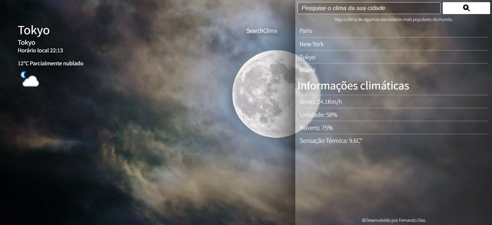
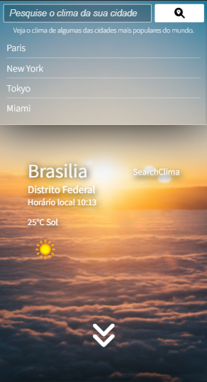
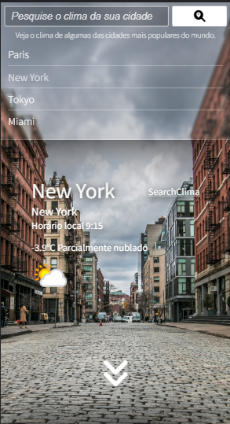

<h1 align="center">SearchClima⛅</h1>

## O que é?

    Projeto no qual podemos recuperar o clima de qualquer localidade. O projeto foi feito com base na <a href="https://www.weatherapi.com/">Weather API</a>. O projeto foi hospedado no github pages, podemos ver o resultado <a href="https://nandins-12.github.io/search-clima/">aqui.</a>

 

## Sobre o projeto

### Tecnologias:

O projeto foi desenvolvido todo em:

* __HTML:__ Linguagem de marcação.

* __CSS:__ O layout foi criado com a metodologia Mobile First, no qual é feito a estilização priorizando a visualização em dispositivos mobiles, depois o responsivo para diversos dispositivos.

* __JavaScript:__ No JavaScript temos a aplicação responsável por capturar os dados da API e atribui-las ao DOM.

### Previews:

    
    
    

